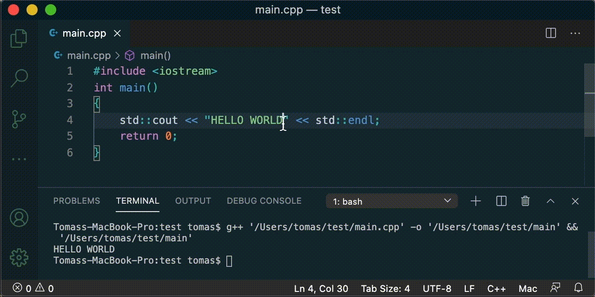

# Cpp-pp

A quick way to build and run the C++ code using the GCC compiler inside VSCode.

> Tip: This is a personal project that is meant to speed-up C++ coding during the Procedural Programming class at Vilnius University.

The extension is as minimal as it can be:
* Uses GCC compiler (make sure you have it installed before using this extension),
* Works with an active document,
* Supports only a single C++ source file (multi-file setup is not supported yet).

## Installation

The extension is not available through the Visual Studio Marketplace, so the only way to install it is to follow steps:
1. Download the latest `vsix` file from the [releases](https://github.com/rendertom/cpp-pp/releases) section.
2. In VSCode, use the **Install from VSIX...** command in the Extensions view (`View -> Extensions`) command drop-down, or the **Extensions: Install from VSIX...** command in the Command Palette, point to the .vsix file.

## How to use

Load or type-in any valid C++ code and open Command Pallete and type one of the following:
* `cpp-pp: build` to build an executable file.
* `cpp-pp: build and run` to build and run code in the active viewer.
* `cpp-pp: run` to execute code, that was built previously.

**Note:** in **building** process the extension will create the executable file in the same folder as the file that's in the active viewer, and will have the same name (but without extension) as the source file.

The extension can also execute the above commands on an unsaved (untitled) document. In this case the *.cpp file will get saved in `~/.vscode/snippet.cpp` location (defined in Preferences) and executed from there. This feature is useful for quick test runs.

## Requirements

  - GCC compiler. For windows, use [minGW](http://www.mingw.org/).

## Extension Settings

This extension contributes the following settings:

* `cpp-pp.autoRun`: Whether to automatically execute the command line,
* `cpp-pp.clearConsole`: Whether to clear the console before executing the command,
* `cpp-pp.flags`: Option to define additional g++ flags,
* `cpp-pp.saveFileBeforeExecution`: Whether to save a dirty file before execution,
* `cpp-pp.temporaryFile`: A path to a temporary file where Untitled document gets saved before execution.

## Todo

* Add support for multi-file setup,
* Add option to use relative paths,
* ...

**Enjoy!**